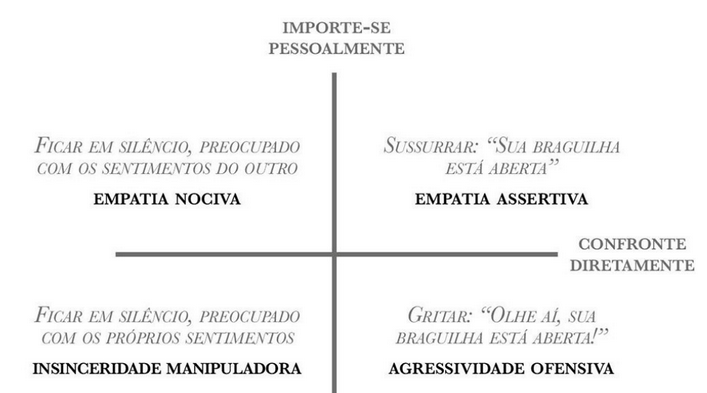
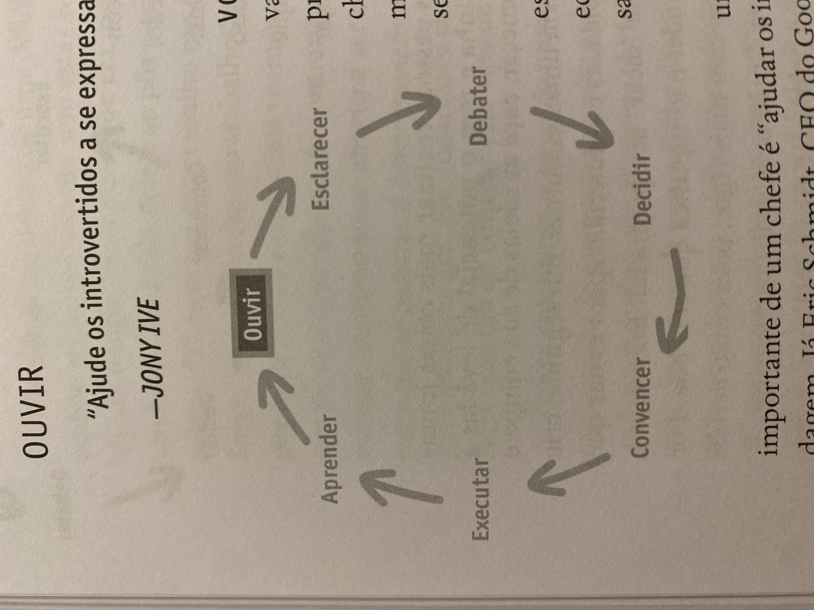

# Empatia Assertiva

## Quadrilátero da Empatia Assertiva

A Empatia Assertiva segue dois eixos:

- Importar-se Pessoalmente
- Desafiar Diretamente

O diagrama abaixo mostra os resultados obtidos quando você caminha mais ou menos em cada um desses eixos

Ver: [Notas sobre Liderança](/zettels/lideranca.md)

## Crescimento gradual vs Crescimento acelerado

Nem sempre um funcionário deseja crescer rapidamente na carreira. Às vezes a pessoa está interessada em se manter onde está, mas aprimorar o que faz naquela posição.
A “Empatia Assertiva” destaca que existem dois tipos de pessoas:

- As estrelas: que são excelentes no que fazem, e querem se manter na posição em que estão, aprimorando o que já fazem
- As super-estrelas: que são excelentes no que fazem, mas querem crescer mais rápido, não necessariamente onde estão

## Lidando com Funcionários Medianos

Em tese não devem existir funcionários medianos, ou eles não devem ser medianos por muito tempo.

Segundo o livro:

> Em muitos aspectos, o trabalho do chefe é definir um padrão de qualidade e garantir que ele seja respeitado. No começo, pode parecer difícil, mas com o tempo ficará claro que é crueldade reduzir os padrões. Não caia na armadilha da Empatia Ruinosa ao gerenciar pessoas que têm um desempenho razoável, e não excelente!

_Empatia Assertiva, cap. 3_

## Modos de ouvir uma pessoa

- Escuta silenciosa: momentos de silêncio em uma conversa permitem que você entenda o que outras pessoas querem dizer realmente
- Falar para ouvir: expor opiniões contraditórias e permitir que os outros apontem os erros desse pensamento
- Criar uma cultura aberta a ouvir: permita que as pessoas deem ideias. Às vezes elas são boas e melhoram o processo. Quando elas são ruins, explique o porquê e dê feedback

## Ciclo de escuta

