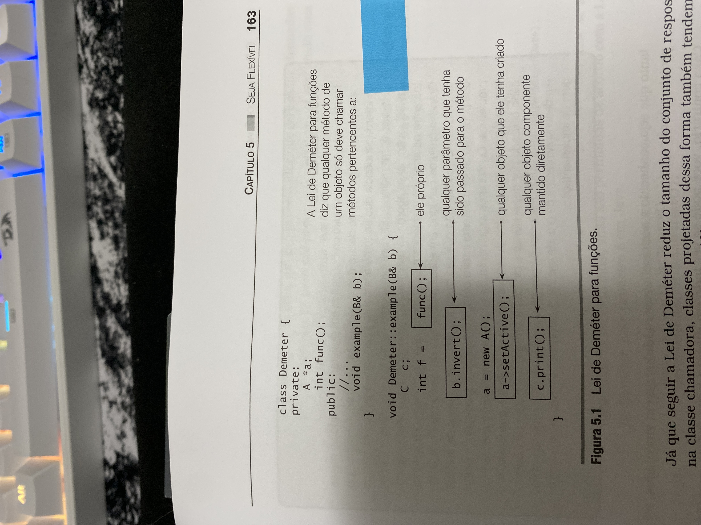

# O Programador Pragmático

[[_TOC_]]

## A programação tem poucas leis, mas muitos padrões

> “Os autores evitaram propor uma teoria de desenvolvimento de software. Isso é bom, porque se o tivessem feito seriam obrigados a direcionar cara capítulo à defesa de sua teoria. Esse direcionamento é a tradição em, digamos, estudo da física, onde teorias acabam se tornando leis ou são descartadas sem alarde. **A programação, por outro lado, tem poucas leis (se tiver alguma).** Portanto, conselhos de programação estruturados em supostas leis soam bem por escrito, mas não funcionam na prática. E isso que está errado em tantos livros de metodologia.

> Estudei esse problema por alguns anos e descobri que **o mais promissor era um artifício chamado _linguagem de padrões”_**

Ward Cunningham na introdução de O programador pragmático

## Não dê desculpas esfarrapadas

> “Dizer a seu chefe ‘o gato comeu meu código-fonte’ não resolverá.

> Forneça opções, não dê desculpas esfarrapadas”

O Programador Pragmático, cap 1

## Não deixe janelas quebradas

> Não deixe "janelas quebradas" (projetos insatisfatórios, decisões erradas ou código inadequado) sem reparos. Conserte cada uma assim que for descoberta. Se não houver tempo suficiente para consertá-la apropriadamente, feche-a com tábuas. Talvez você possa desativar com comentários o código inadequado, exibir uma mensagem "Não Implementado" ou substituí-lo por dados fictícios. Tome alguma medida para impedir um dano maior e mostrar que você está com a situação sob controle.

O Programador Pragmático, Cap 1

## Sopa de Pedras

> Os três soldados que voltavam da guerra estavam famintos. Quando viram a vila à frente, se animaram - tinham certeza de que os aldeões lhes dariam uma refeição. Mas, quando lá chegaram, encontraram as portas trancadas e as janelas fechadas. Após muitos anos de guerra, os aldeões estavam com pouca comida e estocavam o que tinham.

> Sem medo, os soldados ferveram água em uma panela e colocaram cuidadosamente três pedras nela. Os aldeões pasmos vieram observar.

> "Essa é uma sopa de pedras", os soldados explicaram. "Isso é tudo que vocês colocam nela?" perguntaram os aldeões. "Exatamente - embora algumas pessoas digam que ela fica ainda melhor com algumas cenouras...

> Um aldeão pôs-se a correr, voltando rapidamente com uma cesta de cenouras de seu estoque.

> Alguns minutos depois, os aldeões perguntaram novamente "É só isso?"

> "Bem," disseram os soldados, "algumas batatas lhe dão sustância". Outro aldeão saiu em disparada.

> Durante a hora que se seguiu, os soldados listaram mais ingredientes que melhorariam a sopa: carne, alho, sal e ervas. A cada vez um aldeão diferente corria para procurar em seus estoques pessoais.

> Eles acabaram obtendo uma grande panela de sopa fumegante. Os soldados removeram as pedras e se sentaram com a vila inteira para apreciar a primeira refeição reforçada que qualquer um deles tinha comido em meses.

Moral da história: Se não é possível mudar tudo, mude uma parte que você tenha acesso e sugira mudanças que caminham para a sua solução.

## A sopa de pedras vista pelos aldeões (ou, O Sapo)

Lembre-se do cenário em larga escala.
Dependendo da mudança pequena na qual se está focado, ela pode fazer todo o software se deteriorar.

É igual a jogar um sapo numa panela com água em temperatura ambiente, e aquecer a água aos poucos até que o sapo esteja cozido.

## A sopa de pedras vista pelos soldados

Moral da história: Se não é possível mudar tudo, mude uma parte que você tenha acesso e sugira mudanças que caminham para a sua solução.

> É mais fácil pedir desculpas do que obter permissão

Contra-almirante Dra. Grace Hopper

## Saiba quando parar

> Não estrague um programa que funciona perfeitamente enfeitando e aprimorando-o excessivamente.

O programador pragmático, pg. 33

## Ortogonalidade

Em computação, o termo foi introduzido para representar um tipo de independência ou desvinculação. Duas ou mais coisas são ortogonais quando alterações em uma não afetam as outras. Em um sistema bem projetado, o código dos bancos de dados será ortogonal à interface do usuário: você pode alterar a interface sem afetar o banco de dados e trocar de banco de dados sem alterar a interface.

## Não confie nas propriedades de coisas que não pode controlar

## WYSIAYG - What You See Is ALL You Got

## Se não pode acontecer, use asserções para assegurar que não aconteça

## Use exceções para problemas excepcionais

> Por que sugerimos essa abordagem para as exceções? Bem, uma exceção representa uma transferência de controle não local imediata - é um tipo de instrução goto em cascata. Programas que usam exceções como parte de seu processamento normal sofrem de todos os problemas de legibilidade e manutenção dos emaranhados de códigos clássicos. Esses programas rompem o encapsulamento: as rotinas e seus chamadores ficam mais fortemente acoplados pela manipulação de exceções.

## Alocação de Recursos

> Aninhe alocações

> 1. Desaloque recursos na ordem oposta em que os alocou. Dessa for-ma, não deixará recursos órfãos se um recurso fizer referências a outro.

> 2. Ao alocar o mesmo conjunto de recursos em diferentes locais de seu código, aloque-os sempre na mesma ordem. Isso reduzirá a possibilidade de deadlock. (Se o processo A reclamar o recurso1 e estiver prestes a reclamar o recurso2, enquanto o processo B tiver reclamado o recurso2 e estiver tentando obter o recurso1, os dois processos esperarão indefinidamente).

## Desvinculação e a Lei de Deméter

> Espiões, dissidentes, revolucionários e assemelhados com frequência são organizados em pequenos grupos de pessoas chamados células. Embora os indivíduos de cada célula possam conhecer uns aos outros, eles não conhecem os que estão em outras células. Se uma célula for descoberta, não haverá soro da verdade que revele os nomes de outras pessoas não pertencentes a ela. A eliminação de interações entre as células protege a todos.

## Lei de Deméter para funções

## Codificação não é mecânica

> A codificação não é mecânica. Se fosse, todas as ferramentas CASE nas quais as pessoas colocavam suas esperanças no início dos anos 80 teriam substituído os programadores há muito tempo. Há decisões a serem tomadas a cada minuto - decisões que requerem ponderação e julgamento cuidadosos se o esperado for que o programa resultante tenha uma vida longa, precisa e produtiva.
